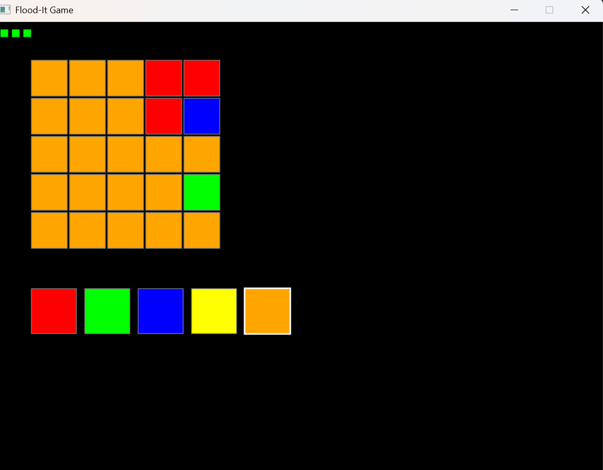

# Project 04 – Flood-It Game

## 🕹️ Description

This is a turn-based color flooding game written in C++ using SDL2. Your goal is to flood the entire board with a single color before running out of moves. With each move, you select a color that will flood from the top-left corner, spreading to all adjacent cells of the same color. The game features increasing difficulty with larger boards as you progress through levels.

## 🎮 Controls

- **Click** on a color in the palette to select it
- **Number keys 1-5** to select colors (1=Red, 2=Green, 3=Blue, 4=Yellow, 5=Orange)
- **R**: Restart the current level
- **Esc**: Exit the game
- Type the secret code to advance to the next level when you win

## 🧪 Screenshot

## ✨ Extra Features

- Progressive difficulty with increasing board sizes
- Secret code system to unlock new levels
- Color palette UI for easy selection
- Move counter and level display
- Win/loss messages with replay option

## 🛠️ Build/Run Instructions

1. Ensure SDL2 is installed (`SDL2`, `SDL2_ttf`).
2. Clone the repository: `git clone https://github.com/NicholasSeward/cpsc2376-sewardn.git`
3. Navigate to `projects/project04/`.
4. Compile: `g++ main.cpp game.cpp -lSDL2 -lSDL2_ttf -o floodit`
5. Run: `./floodit`